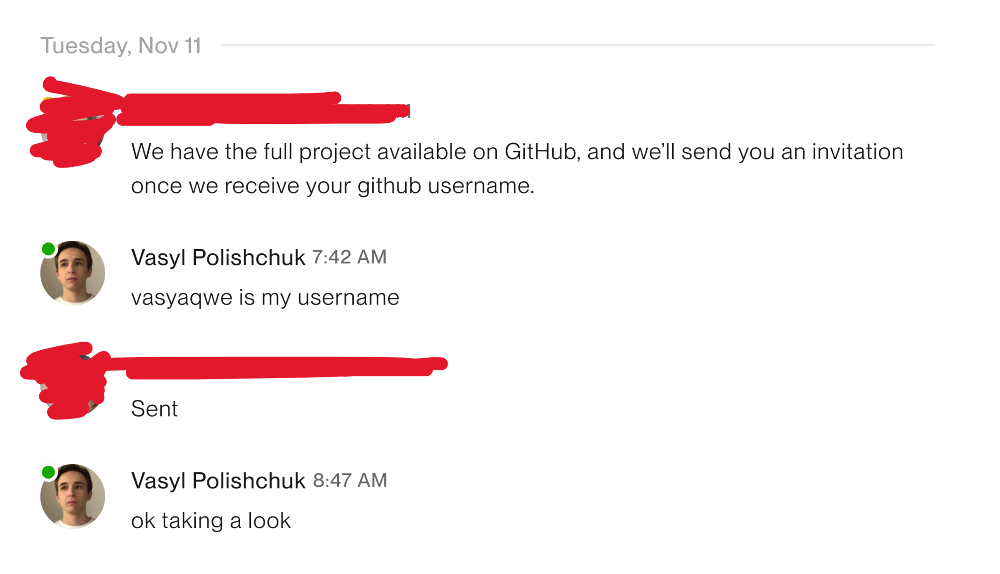

## The setup

First, you're talking to a potential client on a platform like Upwork.
They ask you to clone a repo and launch their project locally.



Worth noting that particular profile had a **0% hire rate** and was registered just a few days ago. Already suspicious.

## The scam

It can be as simple as a vibe-coded Next.js app. Be careful running a command like `npm run dev`, because that may execute a malicious script.

To a normal eye, nothing is off. In the `package.json`, `npm run dev` simply runs `next dev` to launch the dev server. But they've got tricks. 

In my case, the script was **meticulously hidden** in the `next.config.js` file with lots of whitespace.

```ts
/** @type {import('next').NextConfig} */
const nextConfig = {
  images: { domains: ["coin-images.coingecko.com"] },
};

module.exports = nextConfig;                                                      const bi=a1,bj=a1,bk=a1,bl=a1,bm=a1;(function(aU,aV){const...
```

Try scrolling the codeblock horizontally to a chunk of the malicious code. 
In the real file, there was much more whitespace, so it was hard to spot. 
You can spot these tricks by looking at the horizontal scrollbar in your editor, same as in the example above.

## What is that gibberish?

It's an intentionally scrambled Node.js script.

When you run `npm run dev`, Node.js loads `next dev`. The next command, in turn, reads its config file... and executes this malicious code block.

This script is a **backdoor and information-stealer**. It's built to:
- `require('os')`: Steals your system info.
- `require('fs')`: Gains access to read, write, and delete any file on your computer.
- `require('https')`: Connects to the attacker's remote server to send them your stolen data.
- `require('child_process')`: Creates a backdoor, allowing the attacker to run any command on your machine remotely.

The script's primary goal was to find and read my ~/.ssh folder, copy all my private keys, and upload them to the attacker.